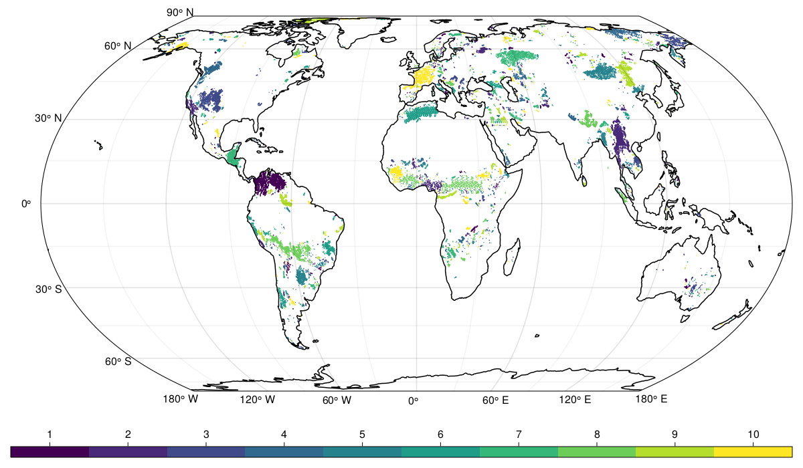

# Minicube-Splitter

Collection of scripts to split the minicubes into cross-validation folds

### Usage

````julia
julia cluster_cubes.jl
````

When running the script, all dependencies will be installed automatically through `Pkg.instantiate`, just run the program with a recent Julia version. Currently the script assumes that the minicubes registry is stored in the same folder as the script and it will write the groups into a `./output/` folder. The number of groups is set to 10 and the distance between groups to 50 km.

You can download the registry with `get_registry.jl`. Please adjust the paths as necessary. 

### Output
`cluster_cubes.jl` outputs a csv file with the minicubes identifiers, location (lon, lat) and their assigned group, as well as a map of the groups of minicubes locations. Example output with 10 groups and 50 km distance are available in [./output/](https://github.com/DeepExtremes/cv-groups-minicubes/tree/main/output).

---
<p float="center">
   
</p>

---

# Authors

[Mélanie Weynants](https://orcid.org/0000-0002-1447-0105) [@melwey](https://www.github.com/melwey), [Fabian Gans](https://orcid.org/0000-0001-9614-0435) [@meggart](https://www.github.com/meggart)

Credits go to [Jake Nelson](https://orcid.org/0000-0002-4663-2420) and [Basil Kraft](https://orcid.org/0000-0002-8491-2730)[@bask0](https://www.github.com/bask0) who did the original python implementation of the splitter this program is derived from. 
